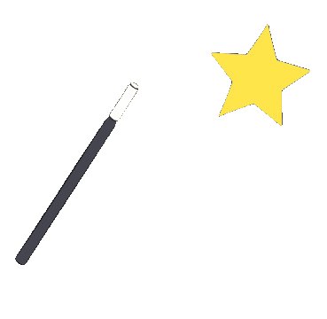
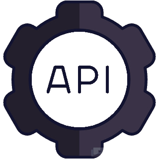
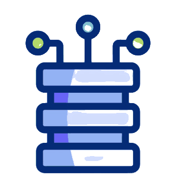
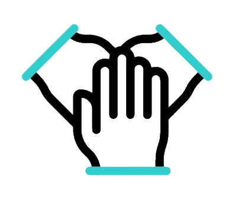

## Hello there, I'm Genta 

---

I’m a <b> Fullstack Web Developer </b> with over <b> 5 years experience </b> in building scalable web applications, managing complex databases, and implementing innovative digital solutions 

-  Developed and maintained **end-to-end web applications**, from frontend interfaces to backend systems.  
-  Designed and implemented **efficient RESTful APIs** for seamless integration.
-  Optimized database performance and built systems capable of handling complex business logic.  
-  Collaborated with cross-functional teams to deliver high-quality software on time.  

I am passionate about learning new technologies, improving code quality, and solving challenging problems to create impactful digital solutions 

---

##  **Tech Stack & Expertise**  
|   |  |
| :---: | :---: |
| Backend Development  | Frontend Development |
|   |   |
| Database Management  | DevOps & Tools |
|  |  |

---

##  **Let's Connect!**  
Feel free to reach out for collaboration    

     &nbsp; 
     &nbsp; 
    

